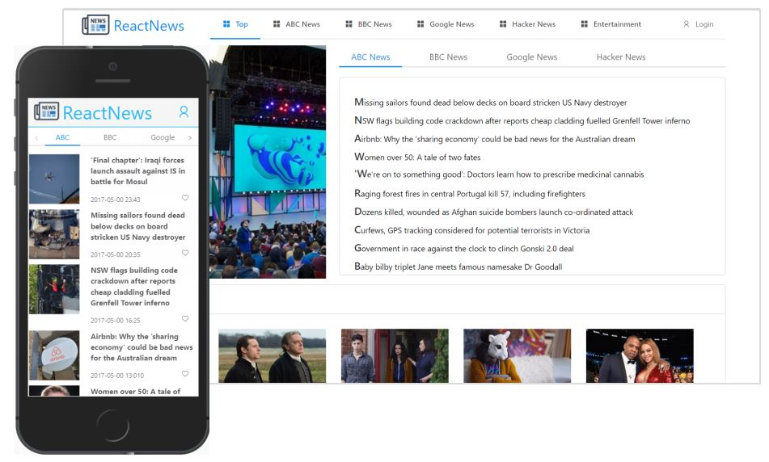

# ReactNews

> 利用React实现响应式新闻页面<br>
> An Responsive News page built by React(v15.5.4) + Ant-design + webpack/babel<br> fast way to get through React.
<br>

# demo

<br>

## Build Setup

``` bash
# install dependencies
npm install

# serve with hot reload at localhost:8080
npm run dev

# build for production with minification
npm run build
```
<br>

#todo item
- Optimize register feature
- Express / mysql
<br>

~(≧▽≦)/~  如果有那么一丁点儿喜欢 请随手🌟~(≧▽≦)/~啦啦啦 <br>
~(≧▽≦)/~  Encourage me a start🌟 if you like it~(≧▽≦)/
